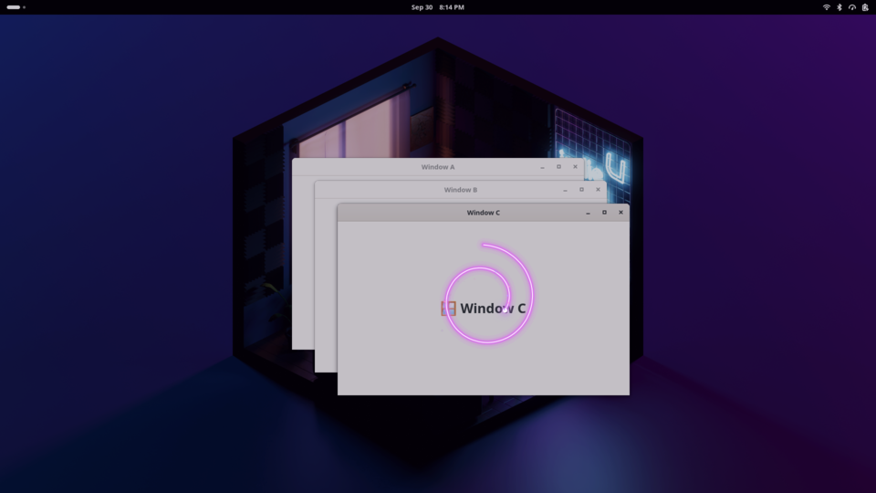
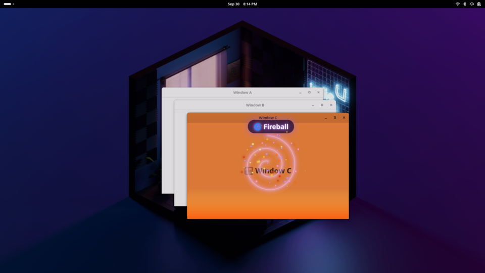
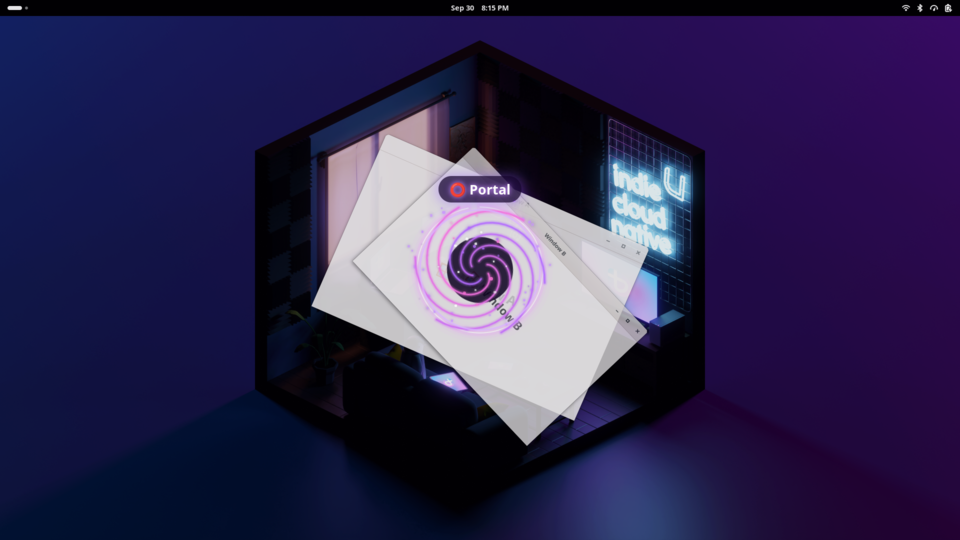
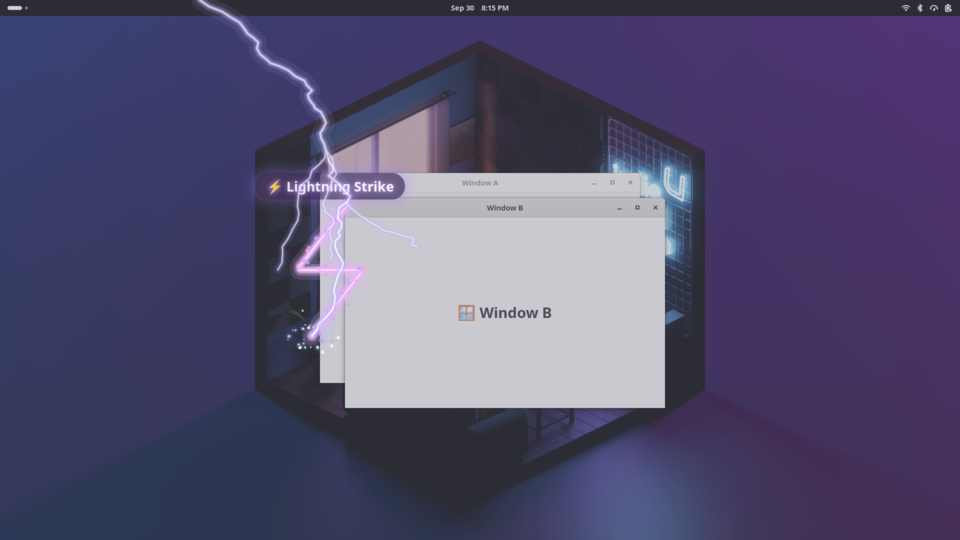
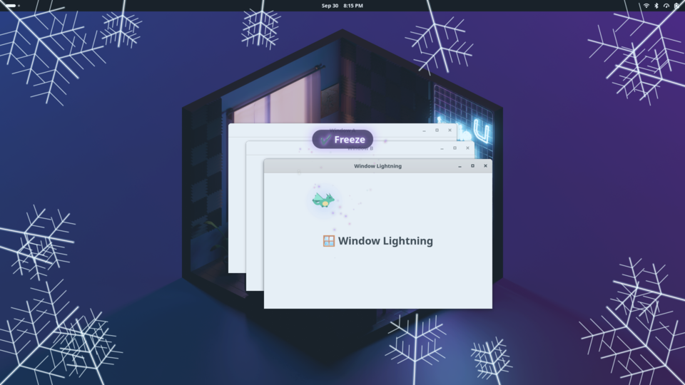
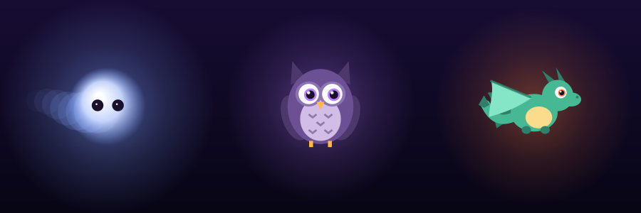
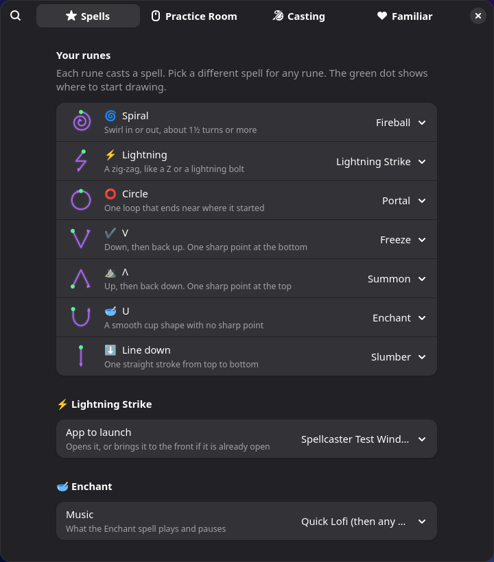

# 🪄 Spellcaster

**Draw glowing runes with your mouse to cast spells on your GNOME desktop.**

Press <kbd>Super</kbd> + <kbd>Z</kbd>, draw a rune, and let go. Your trail glows, the rune flares, and the spell goes off.



## The runes

Every rune is **one quick stroke**. You never lift the mouse, and there are no stars or waves.

| Rune | Draw it | Spell | What happens |
|---|---|---|---|
| 🌀 Spiral | Swirl in or out, about 1½ turns | **Fireball** | The window under the spiral catches fire and closes. Apps with unsaved work still ask "Save?" |
| ⚡ Zig-zag | Like a Z or a lightning bolt | **Lightning Strike** | A bolt cracks down and an app launches (Godot by default) |
| ⭕ Circle | One loop | **Portal** | Every window spirals into a portal. Cast it again and they fly back out |
| ✔️ V | Down, then up | **Freeze** | Frost spreads over the screen, then it locks |
| ⛰️ Λ | Up, then down | **Summon** | Your familiar appears, or goes away if it's already out |
| 🥣 U | A smooth cup | **Enchant** | Sparkles fall and lofi starts or pauses (Quick Lofi first) |
| ⬇️ Line down | One straight stroke | **Slumber** | A curtain falls and the PC **suspends**. Click during the curtain to cancel |

Esc or a right-click cancels casting. A stroke that isn't a rune just **fizzles**.

Any rune can be rebound in the Spellbook to: Snapshot (screenshot), Scry (overview), Step Left/Right (workspaces), a custom command, or nothing.

| | |
|---|---|
|  |  |
|  |  |

## Familiars



A **wisp**, an **owl** or a **tiny dragon** keeps you company. It's built to never get in the way:

- your clicks pass straight through it
- it keeps its distance, and fades and drifts off if your cursor gets close
- it **hides while a game or video is fullscreen**
- it never makes a sound
- it naps under the top bar when you're idle (*z z z*)
- it glows **blue → purple → orange** as your CPU gets busier
- it watches you cast, spins when a spell works, and goes "oops" when one fizzles

You can set it to *Follow* (lazily trails the cursor), *Perch* (sits in a corner) or *Wander* (drifts around the screen edges).

## The Spellbook

Open it from the Extensions app, or run `gnome-extensions prefs spellcaster@gamerdolphin.github.io`.



- **Spells:** choose the spell for each rune, the app Lightning launches, what Enchant plays, and how long the Slumber curtain takes
- **Practice Room:** draw runes and see what Spellcaster thinks they are, with nothing cast. It also has a "How picky" slider
- **Casting:** the shortcut, trail colour (Arcane, Ember, Frost, Fey, Chaos), thickness, and *Reduce effects*
- **Familiar:** a live preview, creature, behaviour, size, opacity and the calm settings

## Install

Requires **GNOME Shell 50**.

```bash
git clone https://github.com/GamerDolphin/spellcaster.git
cd spellcaster
make install
```

Then **log out and back in** (on Wayland, GNOME only loads new extensions at login) and run:

```bash
gnome-extensions enable spellcaster@gamerdolphin.github.io
```

If you're working on the code, use `make dev-install` instead. It links the folder, so your edits apply after the next login.

## Development

```
spellcaster@gamerdolphin.github.io/
├── extension.js        wires everything together
├── prefs.js            the Spellbook
├── lib/
│   ├── recognizer.js   stroke → rune (pure JS, no GNOME imports)
│   ├── castOverlay.js  cast mode: input grab + glowing trail
│   ├── fx.js           particles, flashes, labels
│   ├── familiar.js     familiar behaviour
│   ├── familiarArt.js  familiar drawings (Cairo, shared with the Spellbook)
│   └── …
└── spells/             one file per spell
```

| Command | What it does |
|---|---|
| `make check` | Syntax check plus the rune recognizer tests (2,800 sloppy fake strokes; each rune must be ≥95% accurate) |
| `make test-shell` | Starts an **invisible, throwaway GNOME Shell**, draws every rune with a virtual mouse, checks the results and saves screenshots to `test-output/`. It never touches your real desktop or settings, and suspend/lock are faked |
| `make pack` | Builds the zip for extensions.gnome.org |

Logs: `journalctl -f -o cat /usr/bin/gnome-shell`

The original design plan is in [docs/PLAN.md](docs/PLAN.md).

## License

GPL-2.0-or-later, like GNOME Shell itself.
